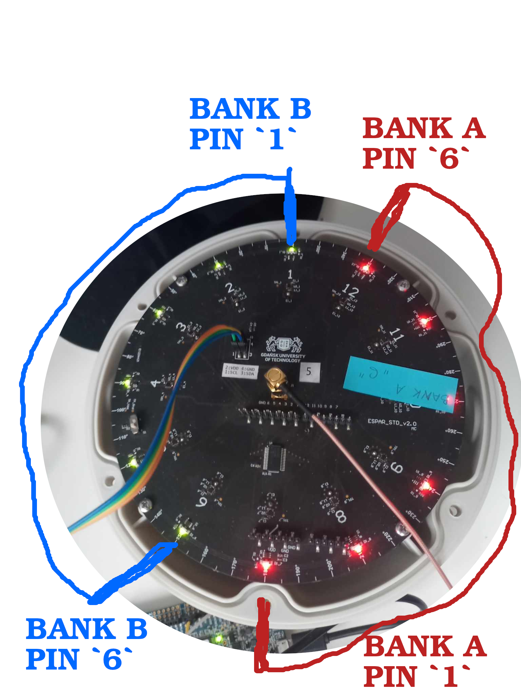

# Projekt Grupowy - sterowanie anteną ESPAR BLE

## Sprzęt

1. nRF52840 Dongle 
    - nadajnik bluetooth

1. nRF52833-DK
    - mikrokontroler do reflektorów/direktorów
 
1. Particle Argon 
    - odczyt przez antenę

1. MCP23018 
    - I2C ekspander GPIO na antenie

1. Antena ESPAR


## Podłączenie TUTORIAL

* nordic DK - MCP
    - scl : P0.27
    - sda : P0.26

* Argon - nordic DK
    - D9 : P0.08
    - D10 : P0.06

* dongle jest samowystarczalny

Po spięciu powyższych wystarczy zasilić każde urządzenie po USB. 

### Demonstracja:

* Umieścić dongle w określonej pozycji względem reszty
* Poczekać, aż skanowanie zatoczy cały okrąg na antenie
* Antena powinna przeskoczyć do pozycji w kierunku dongla
* Przenieść dongle na drugą stronę
* Zaobserwować, jak antena skanuje ponownie i znajduje nową pozycję 


## Założenia w skrócie

* Nadajemy sygnał przez dongle
* podpinamy nordic-DK w celu zmiany direktorów/reflektorów
* przez Argon zczytujemy sygnał z anteny, badamy kiedy jest najsilniejszy 
* nordic-DK wtedy przestaje obracać, ustawia się w tym położeniu gdzie jest
    najlepszy sygnał 


## Zadania

- połączenie nordic - MCP
    * Przygotowanie środowiska do pracy z Nordiciem, prosty hello world
    * Realizacja wymiany najprostszych komunikatów z MCP
    * Opracowanie API do obsługi direktorów 

- połączenie Argon - antena

- nadajnik bluetooth z nRF52840 Dongle

- komunikacja między Argonem a nRF52-DK
    - i tak muszą być razem przy antenie, więc chyba można je spiąć po serialu
      co byłoby najłatwiejsze 
 
--- 

## ESPAR, nRF52-DK

* programowany przez VSCode i nRFConnect
* zephyrRTOS

 

### Status

Rotowanie pięcioma direktorami działa, możnaby ew. uporządkować kod i 
przygotować na odbiór statusu z Argona i zatrzymywanie się na danej pozycji
dla najlepszego sygnału

**Proponowany algorytm**

* ESPAR obraca się
* dla każdej pozycji odbiera i przypisuje z Argona poziom sygnału
* po obrocie o 360st typuje maksimum i ustawia się do pozycji z przypisanym
    tym właśnie maksimum
* ew. dalej pobiera dane z Argona i patrzy, czy poziom sygnału nie zmienia się;
    w wypadku zmiany poniżej X% ponownie przechodzi do skanowania 

**Pytanie:** Czy trzeba "słuchać" seriala po uarcie w osobnym wątku?

* raczej **nie**, powinno to działać na zasadzie: 
    - ustawiamy direktory w pozycję
    - czekamy aż argon wykona skan
    - w momencie odebrania sygnału na UART idziemy do kolejnej pozycji
        czyli właściwie uart event zamiast sleepów

### Drugi status

Obecnie obracanie ESPARa jest "taktowane" komunikatami z Argona. Po odebraniu 
wiadomości, rotuje do kolejnej pozycji.

**Założenie:** chcemy na nrf52-DK realizować jedynie API do rotacji, np 
* nasłuch po serialu komend `rotate X` (gdzie X to środkowy 
    direktor) i `hold`.
* ew. odpowiedź w postaci `current pos: X` (znowu X - direktor)

Skanowaniem, monitorowaniem poziomu sygnału, decyzją o rotowaniu lub przyjęciu
określonej pozycji będzie zajmował się argon.

### Obecny status

ESPAR API to komendy rotate X i hold, obecnie nie zwraca żadnych odpowiedzi.

---

## Particle Argon

Będzie miał podpiętą antenę i odbierał przez nią sygnał z nadajnika.
Teoretycznie do "łatwego" programowania po USB przez webowe IDE. 

Praktycznie:

### Pierwszy status

Argon po USB świecił na stały kolor, co wskazywało na problem z wgranym kodem. 
Nie wykrywał się nigdzie w Linuksie ani Windowsie, tym bardziej w aplikacjach
webowych particle.io.

### Ważne

Factory reset
```
1. Begin holding the MODE button down.
2. While holding the MODE button down, tap the RESET button briefly.
3. After 3 seconds the core will begin blinking yellow, KEEP HOLDING the MODE button.
4. After 10 seconds the core will begin blinking white. When this happens the factory reset process has begun. Let go of the MODE button.
5. When it stops blinking white, it should begin blinking blue, indicating that it is listening for WiFi credentials.
```

```
Device ID: e00fce68812c878ef08a8c68
Device Secret: G8F5XFL7SGTL8JN
Serial Number: ARNHAD2142DVAKL
```

* [status LED troubleshoot](https://docs.particle.io/troubleshooting/led/argon/)
* [claiming guide](https://diotlabs.daraghbyrne.me/docs/getting-started/4-claim-it/) 
* [argon info](https://www.hackster.io/ruchir1674/getting-started-with-particle-argon-and-xenon-1a1ea4)
* [particle docs, sekcja o BLE](https://docs.particle.io/reference/device-os/firmware/#ble-selectantenna-)

### Trzeci status

**CO ZADZIAŁAŁO:**
* SDK: wystarczy dodatek `Particle Workbench` dla `VSCode`
* factory reset
* `particle setup`
* `particle serial --wifi`
* `Particle: Cloud flash`
* `Particle: Flash device for debug` 
* `particle list`
 
Udało się przeflashować basic program testowy migający D7 i dający output
po serialu. W takim razie - można zacząć pracę nad

- odczytem sygnału z koncentryka
- komunikacją (jakąś) z NRF52-DK

Ciekawostka: Particle Argon ma nRF52840 SoC 

### Czwarty status

Udało się odpalić podstawowy kod na skanowanie BLE:

* Przy skanowaniu anteną wewnętrzną wykrywa ciągle kilka urządzeń o różnej mocy
* Po zmianie na antenę zewnętrzną **bez** podpinania ESPARa nie wykrywa nic - 
    co potwierdzałoby, że sama zmiana użytej anteny działa.
* Po podpięciu ESPARa, nadal korzystając z zewnętrznej anteny, natychmiast
    znowu wykrywa urządzenia, o podobnym poziomie sygnału co wewnętrzną anteną.
 
Trzeba ogarnąć jak go flashować bez DeviceOS'a 

### Piąty status

Co chcemy mieć? 

tryby

* skanowanie 
    - zacznij od 1 direktora, obracaj się aż wrócisz do pierwszego direktora
        * rotate 1
        * rotate next (...)
    - dla każdej pozycji zapisuj w tablicy najlepszą moc sygnału 
    - ( potem filtracja po nazwie ) 

* utrzymanie pozycji i monitorowanie poziomu sygnału
    - po skanowaniu wybierz najlepszą pozycję i wróć do niej

ważne: synchronizuj się cały czas z argonem, żeby sprawdzić czy pozycje są 
zgodne 


**Zsynchronizowane algorytmy**

**Argon**

* Setup
    - ustaw się na 1 direktor, ustaw ESPAR na 1 direktor, zaczekaj na 
    potwierdzenie

* Loop
    - SCAN
        - każ esparowi ustawić się na CURR_POS
        - odbierz potwierdzenie, że jest na CURR_POS

        - skanuj po BT
        - wybierz najlepszy sygnał
        - przypisz do listy sygnałów

        - jeśli <12, zwiększ CURR_POS
        - jeśli nie, przejdź do wyboru i HOLD
    - HOLD


**ESPAR**

* Inicjalizacja


* Loop - serial event
    - rotate x:
        - pobierz x
        - rotuj, aż nie x
        - napisz, że CURR_POS = x

    - hold:


### Obecny status

Argon wysyła `rotate X` lub `hold`. Znajduje najlepsze położenie i przechodzi do monitorowania poziomu.
W razie nagłego spadku poziomu sygnału o zadaną wartość, skanuje ponownie.

---

## nRF52840 Dongle

* można programować z nRFConnect w VSCode, po podpięciu tasiemką do DK
* po USB pojawia się jako serial i jako urządzenie blokowe (bootloader), więc
    tak też można wrzucać hexy 
* jednak najbardziej niezawodny **J-Link** w nrf52-DK - automatycznie się 
  przełącza po podpięciu

### Status

Udało się odpalić advertising na donglu przez modyfikację przykładowej 
aplikacji LLPM. Dzięki temu argon go wykrywa podczas skanowania anteną i podaje
poziom sygnału. 

Można teraz zbadać, jak mocno zmienia się poziom sygnału w zależności od 
ułożenia direktorów.

Opcjonalna modyfikacja to byłoby ustawienie konkretnego ID i szukanie go 
Argonem, żeby wykluczyć niezwiązane urządzenia - TBD czy wchodzi w zakres
projektu


### Ważne

* [tutorial flashowania](https://devzone.nordicsemi.com/guides/short-range-guides/b/getting-started/posts/nrf52840-dongle-programming-tutorial) 

---

